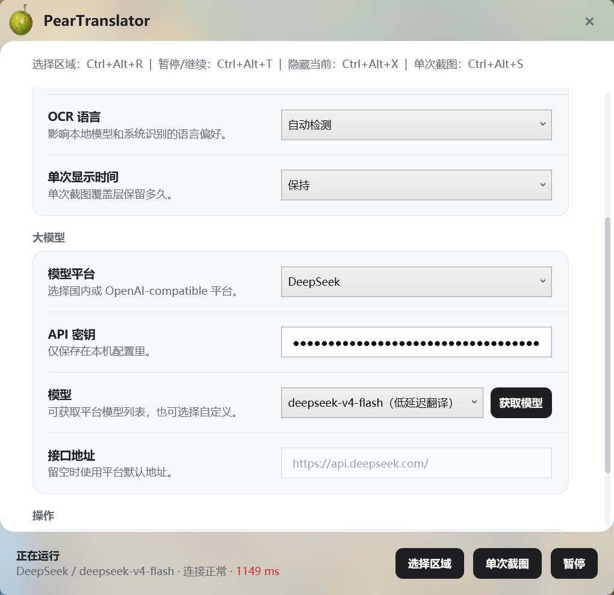
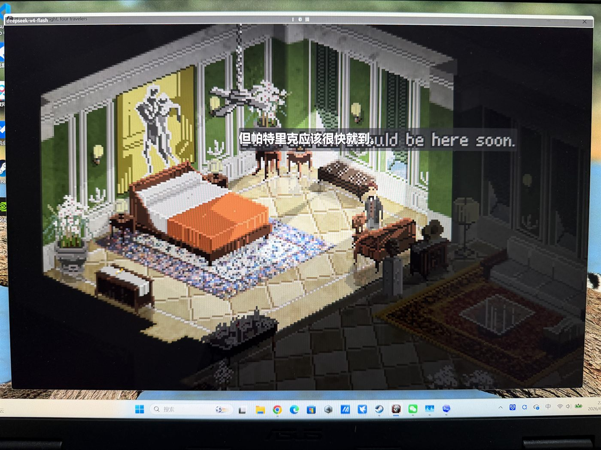

# PearTranslator

简体中文 | [English](README.en.md)

PearTranslator 是一个面向 Windows 桌面的屏幕翻译工具，主要用于游戏字幕、浏览器页面和桌面窗口里的英文/外文文本。它会截取你框选的屏幕区域，在本地进行 OCR 识别，再把翻译结果显示到轻量级 overlay 上。

当前方向是 Windows 优先：好看的 WPF 界面、尽量低延迟的屏幕捕获、本地高精度 OCR，以及可配置的大模型/传统翻译服务。

## 预览

### 设置界面



### 游戏实时翻译



### 中英混合覆盖


## 支持环境

支持：

- Windows 10 2004 或更高版本，系统 build 19041+
- Windows 11
- 推荐 x64 Windows
- 开发环境需要 .NET 8 SDK

暂不支持：

- macOS
- Linux
- 移动端

PearTranslator 使用 WPF、Windows 桌面 API、全局快捷键、托盘图标、Windows Graphics Capture 和 Windows 特定 overlay 行为，所以目前不能直接在 macOS 或 Linux 上运行。

## 功能

- 游戏、浏览器、桌面窗口的框选区域实时翻译。
- 单次截图翻译，可与实时 overlay 共存。
- 基于 RapidOcrNet 和 PaddleOCR ONNX 模型的本地 OCR。
- OCR 语言支持自动检测、英文、中文、日文、韩文。
- 目标语言过滤，支持翻译到简体中文或英文。
- 支持 OpenAI-compatible 大模型平台，包括 OpenAI、DeepSeek、通义千问/Qwen、Kimi、智谱、豆包和自定义接口。
- 支持传统翻译服务，包括 Azure Translator、DeepL 和 Google Cloud Translation Basic。
- 大模型返回前可选本地词典首词预览。
- 支持鼠标穿透 overlay、框选区域虚线标记、overlay 不参与屏幕捕获。

## 快速开始

普通用户可以直接下载 Windows x64 发布包：

[下载 PearTranslator-win-x64.zip](https://github.com/AmberSunko/PearTranslator/releases/download/v0.1.0/PearTranslator-win-x64.zip)

下载后解压 zip，进入解压出的文件夹，启动：

```text
PearTranslator.App.Wpf.exe
```

第一次使用时，在设置界面点击 **配置模型**，应用会自动下载 OCR 模型、ECDICT 字典和必要的第三方许可证文本到：

```text
%LocalAppData%\PearTranslator\Assets
```

下载完成后即可直接框选区域使用，不需要安装 .NET SDK、Visual Studio 或手动运行脚本。

如果是从源码开发，先安装 .NET 8 SDK，然后 clone 仓库并运行：

```powershell
powershell -ExecutionPolicy Bypass -File scripts/setup-third-party.ps1
dotnet restore PearTranslator.sln
dotnet run --project src/PearTranslator.App.Wpf/PearTranslator.App.Wpf.csproj
```

`setup-third-party.ps1` 会把 OCR 模型和 ECDICT 字典下载到 `third_party/`。这些文件体积较大，并且有各自的许可证，所以不会直接提交到 Git。

## 快捷键

- `Ctrl+Alt+R`：选择实时翻译区域
- `Ctrl+Alt+T`：暂停或继续实时翻译
- `Ctrl+Alt+X`：隐藏当前实时 overlay
- `Ctrl+Alt+S`：单次截图翻译
- `Esc`：退出框选区域

## 翻译设置

打开应用设置面板后选择翻译服务。

大模型 / OpenAI-compatible 服务通常需要：

- 选择模型平台。
- 填写 API 密钥。
- 选择预设模型，或选择自定义模型。
- 如果使用自定义接口，填写兼容接口地址。

应用设置会保存到：

```text
%AppData%\PearTranslator\settings.json
```

不要把这个文件提交到 Git，因为它可能包含 API Key。

应用也支持通过环境变量读取配置：

```powershell
$env:OPENAI_API_KEY = "sk-..."
$env:PEAR_TRANSLATOR_OPENAI_API_KEY = "sk-..."
$env:PEAR_TRANSLATOR_OPENAI_MODEL = "gpt-5.4-mini"
$env:PEAR_TRANSLATOR_OPENAI_BASE_URI = "https://api.openai.com/v1/"
```

更多说明见 [docs/openai-translation-setup.md](docs/openai-translation-setup.md)。

## 构建

```powershell
dotnet build PearTranslator.sln
```

## 测试

```powershell
dotnet test PearTranslator.sln
```

## 发布 Windows 版本

```powershell
dotnet publish src/PearTranslator.App.Wpf/PearTranslator.App.Wpf.csproj `
  -c Release `
  -r win-x64 `
  --self-contained true `
  -o artifacts/PearTranslator-win-x64
```

发布产物会被 Git 忽略。如果要放到另一台 Windows 电脑运行，可以把 `artifacts/PearTranslator-win-x64` 文件夹压缩成 zip 后拷贝过去。

## 第三方资源

本仓库不直接提交大型 OCR 模型和 ECDICT CSV 字典。发布包用户可以在应用设置里点击 **配置模型** 自动下载到 `%LocalAppData%\PearTranslator\Assets`。

源码开发者也可以运行：

```powershell
powershell -ExecutionPolicy Bypass -File scripts/setup-third-party.ps1
```

资源来源和许可证说明见 [docs/third-party-assets.md](docs/third-party-assets.md) 和 [THIRD_PARTY_NOTICES.md](THIRD_PARTY_NOTICES.md)。

## 许可证

PearTranslator 源码使用 MIT License。第三方模型、字典、NuGet 包和翻译 API 仍遵循各自的许可证和服务条款。
